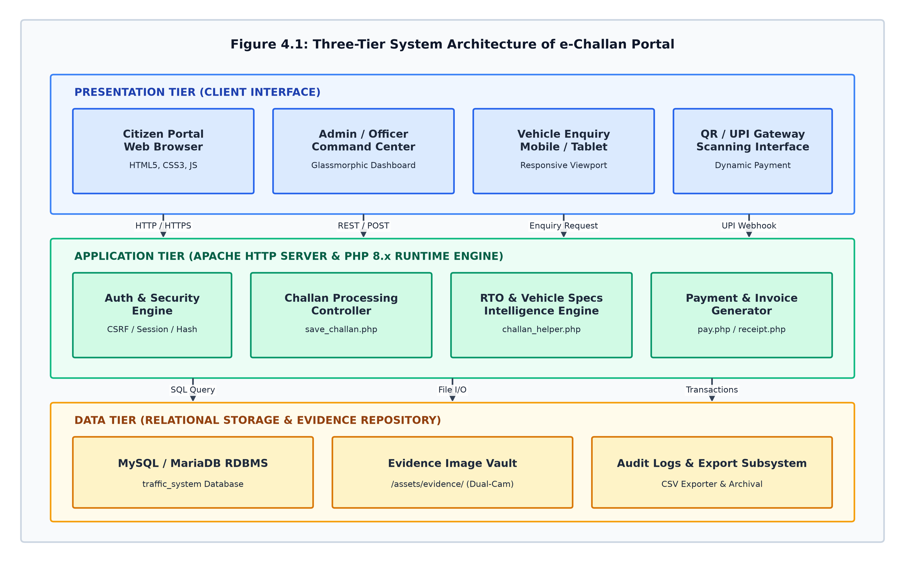
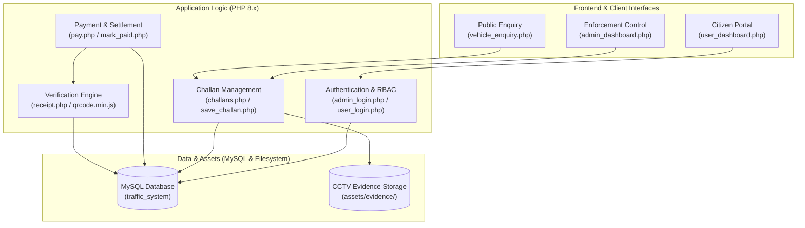
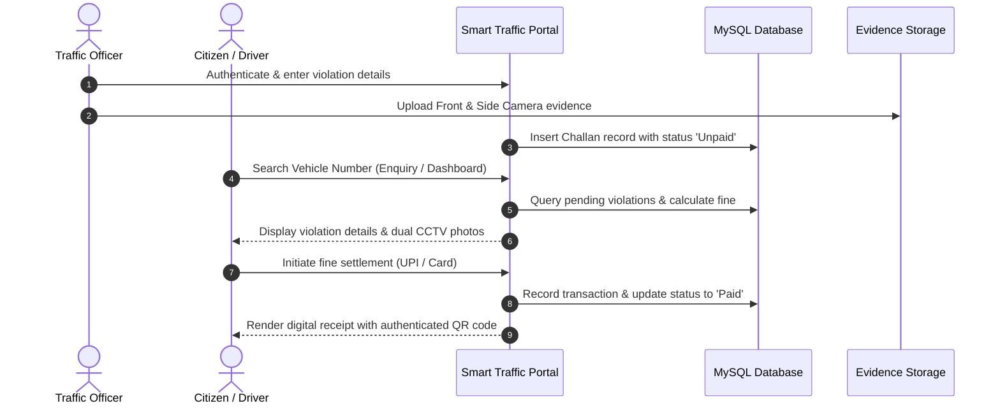
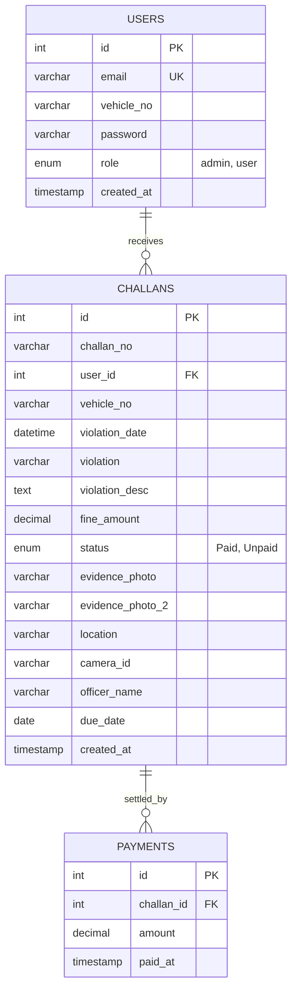

> [!NOTE]
> **[Smart Traffic Control & E-Challan Portal v2.0 is live](https://github.com/nevinmathew224-sudo/smart-traffic-control-E-Challan-poral):** dual-angle CCTV evidence inspection, automated fine generation, instant QR & UPI digital settlement, VAHAN vehicle intelligence, and automated academic engineering reports.

<div align="center">

<picture>

</picture>

<p align="center">
  
  
  
  
  
  
</p>

### Smart Traffic Control & E-Challan Management Portal

**Developed by [NEVIN MATHEW](https://github.com/nevinmathew224-sudo)**

An end-to-end, enterprise-grade automated traffic enforcement, dual-angle CCTV evidence inspection, and digital fine settlement system engineered for modern transportation authorities and smart cities. **Zero paper, 100% verifiable.**

**This repository contains the complete open-source portal: responsive web application, automated database seeding, dual-camera surveillance pipeline, QR receipt engine, and Python document generator.**

<p><strong>Clone & Launch the Portal</strong></p>

```bash
git clone https://github.com/nevinmathew224-sudo/smart-traffic-control-E-Challan-poral.git
```

<sub>Ready to run on any local Apache/PHP/MySQL stack (XAMPP, WampServer, or LAMP) in under 2 minutes.</sub>

---

<p align="center">
  <a href="#quick-start"><b>🚀 Quick Start</b></a>&nbsp;&nbsp;&nbsp;&nbsp;•&nbsp;&nbsp;&nbsp;&nbsp;
  <a href="#key-capabilities"><b>⚡ Key Capabilities</b></a>&nbsp;&nbsp;&nbsp;&nbsp;•&nbsp;&nbsp;&nbsp;&nbsp;
  <a href="#system-architecture"><b>🏛️ Architecture</b></a>&nbsp;&nbsp;&nbsp;&nbsp;•&nbsp;&nbsp;&nbsp;&nbsp;
  <a href="Traffic_Control_e_Challan_Project_Report.pdf"><b>📄 Project Report (PDF)</b></a>&nbsp;&nbsp;&nbsp;&nbsp;•&nbsp;&nbsp;&nbsp;&nbsp;
  <a href="#common-questions"><b>❓ FAQ</b></a>
</p>

---

</div>

> [!TIP]
> **Academic & Engineering Documentation:** Download the complete 80+ page project report [Traffic_Control_e_Challan_Project_Report.pdf](Traffic_Control_e_Challan_Project_Report.pdf) with comprehensive system analysis, UML flowcharts, ER diagrams, test matrices, and implementation source listings.

---

## Table of Contents

- [Table of Contents](#table-of-contents)
- [What is Smart Traffic Portal?](#what-is-smart-traffic-portal)
  - [Why This System Exists](#why-this-system-exists)
  - [Dual-Angle Surveillance Evidence](#dual-angle-surveillance-evidence)
  - [Beyond Traditional Manual Challaning](#beyond-traditional-manual-challaning)
- [System in Action](#system-in-action)
- [Quick Start](#quick-start)
  - [Prerequisites](#prerequisites)
  - [Installation \& Configuration](#installation--configuration)
  - [Default Demo Credentials](#default-demo-credentials)
- [Key Capabilities](#key-capabilities)
- [System Architecture](#system-architecture)
  - [End-to-End Workflow Flowchart](#end-to-end-workflow-flowchart)
  - [Database Schema (ER Diagram)](#database-schema-er-diagram)
- [Documentation \& File Reference](#documentation--file-reference)
- [Automated Report Generator](#automated-report-generator)
- [Security, Scope, and Data Integrity](#security-scope-and-data-integrity)
- [License](#license)
- [Acknowledgements](#acknowledgements)
- [About the Author](#about-the-author)
- [Common Questions](#common-questions)
  - [Can I self-host this portal locally without an active internet connection?](#can-i-self-host-this-portal-locally-without-an-active-internet-connection)
  - [How does the QR verification code on receipts prevent tampering?](#how-does-the-qr-verification-code-on-receipts-prevent-tampering)
  - [Can I add custom traffic violation types and statutory fine amounts?](#can-i-add-custom-traffic-violation-types-and-statutory-fine-amounts)
  - [How does the dual-angle camera evidence upload work?](#how-does-the-dual-angle-camera-evidence-upload-work)
  - [How do I re-compile the academic project report?](#how-do-i-re-compile-the-academic-project-report)

---

## What is Smart Traffic Portal?

The **Smart Traffic Control & E-Challan Portal** is a web-based e-governance system designed to modernize and automate municipal and highway traffic enforcement. By connecting surveillance camera streams with real-time vehicle database lookups, the system enables traffic police officers to review dual-angle photo evidence, issue statutory e-challans, and allow citizens to verify and settle their penalties through secure online gateways.

Traditional enforcement relies on manual paper chits, physical interception of vehicles, and cash transactions—vulnerabilities that introduce traffic congestion, dispute backlogs, and revenue leakages. This platform addresses these shortcomings by delivering an automated, paperless, and tamper-evident digital pipeline.

<a id="why-this-system-exists"></a>
<details>
<summary><strong>Why This System Exists</strong></summary>

Rapid urbanization and vehicular proliferation have created critical traffic enforcement bottlenecks. Manual on-road policing is dangerous, labor-intensive, and susceptible to disputes regarding whether an offense actually took place.

By shifting enforcement to an automated digital model, traffic departments can:
- **Drastically reduce on-road friction:** Violations captured by automated camera stations are processed asynchronously without stopping traffic flow.
- **Eliminate dispute ambiguity:** Every challan is bound to photographic evidence from multiple camera perspectives (front license plate view + wide contextual angle).
- **Accelerate fine recovery:** Citizens receive instant transparency into offenses and can pay immediately via UPI, Net Banking, or Debit Cards.

</details>

<a id="dual-angle-surveillance-evidence"></a>
<details>
<summary><strong>Dual-Angle Surveillance Evidence</strong></summary>

Single-camera enforcement frequently fails scrutiny in judicial traffic tribunals because lighting, occlusions, or extreme angles can obscure vehicle context or driver actions.

This platform implements a **Dual-Angle Evidence System**:
1. **Primary Camera (Front Plate Zoom):** Captures high-resolution optical recognition footage of the vehicle registration plate.
2. **Context Camera (Side/Wide View):** Captures the environment, driver seat position, helmet or seatbelt status, lane markers, and traffic signal color.

Both captures are permanently cryptographically referenced to the challan record, making evidence indisputable during citizen audits or legal challenges.

</details>

<a id="beyond-traditional-manual-challaning"></a>
<details>
<summary><strong>Beyond Traditional Manual Challaning</strong></summary>

Most existing academic projects offer rudimentary CRUD forms without considering civic UX, security safeguards, or auditability.

Smart Traffic Portal is built with production-grade architectural principles:
- **CSRF Protection:** Hardened session-bound tokens across all state-mutating forms.
- **SQL Injection Prevention:** 100% parameterized prepared statements via PHP MySQLi.
- **Dynamic Vehicle Intelligence:** Integrated fuzzy vehicle enquiry search matching plate formatting variations (`KL 07 CD 1234` vs `KL07CD1234`).
- **Dynamic PDF/DOCX Report Compilation:** Automated academic reporting engine written in Python generating print-ready IEEE/University-format documentation.

</details>

---

## System in Action

The repository includes pre-generated architectural blueprints, data flow diagrams, and sample dual-angle CCTV evidence captures:

| Diagram / Asset | Description | Reference Link |
| :--- | :--- | :--- |
| **System Architecture** | Tiered overview of Web Client, Enforcement Services, Relational Layer | [View Blueprint](report_assets/diagrams/fig4_1_architecture.png) |
| **Entity-Relationship Model** | Normalized relational schema covering Users, Challans, and Payments | [View ERD](report_assets/diagrams/fig4_6_er_diagram.png) |
| **Data Flow Diagram (Level 1)** | Visual breakdown of citizen enquiry, admin issuance, and payment capture | [View DFD](report_assets/diagrams/fig4_4_dfd_level_1.png) |
| **Dual CCTV Evidence Samples** | High-definition front and side camera captures across 8 violation classes | [Browse Assets](assets/evidence/) |
| **Official Academic Report** | Complete 80+ page thesis document formatted with custom university typography | [Download PDF](Traffic_Control_e_Challan_Project_Report.pdf) |

---

## Quick Start

### Prerequisites

- **Web Server:** [XAMPP](https://www.apachefriends.org/), [WampServer](https://www.wampserver.com/), or standalone **Apache 2.4+**.
- **Runtime:** **PHP 8.0, 8.1, or 8.2** with `mysqli`, `gd`, and `session` extensions enabled.
- **Database Engine:** **MySQL 8.0+** or **MariaDB 10.4+**.
- **Python (Optional for report generation):** **Python 3.10+** with `python-docx` and `pywin32`.

---

### Installation & Configuration

> [!WARNING]
> Ensure that your MySQL database server is started before running migrations or loading the application.

```bash
# 1. Clone the repository into your web server's public root
# For XAMPP on Windows:
cd c:\xampp\htdocs
git clone https://github.com/nevinmathew224-sudo/smart-traffic-control-E-Challan-poral.git smart_traffic
cd smart_traffic

# 2. Start Apache and MySQL in XAMPP Control Panel

# 3. Create database and load the schema
mysql -u root -p -e "CREATE DATABASE IF NOT EXISTS traffic_system;"
mysql -u root -p traffic_system < database/schema.sql

# 4. (Recommended) Seed 50+ sample users, vehicles, and challans
mysql -u root -p traffic_system < database/seed_50_users_and_challans.sql

# 5. Seed default Administrator credentials
mysql -u root -p traffic_system < database/create_admin.sql
```

Open your browser and navigate to:
```text
http://localhost/smart_traffic/
```

---

### Default Demo Credentials

| Portal | URL Path | Username / Identifier | Password | Access Privileges |
| :--- | :--- | :--- | :--- | :--- |
| **Admin Enforcement** | `/admin_login.php` | `admin@traffic.com` | `1234` | Full system control, issue challans, upload CCTV photos, manage officers |
| **Citizen Portal** | `/user_login.php` | `aarav.sharma@trafficdemo.com` *(or vehicle `KL07CD1234`)* | `1234` | View issued challans, inspect evidence photos, settle fines, print receipts |
| **Public VAHAN Search** | `/vehicle_enquiry.php` | *Public Access (No login required)* | *None* | Instant vehicle lookup by registration number |

---

## Key Capabilities

- **Automated E-Challan Issuance:** Enforcement officers can log violations specifying vehicle number, statutory violation category, date/time, exact GPS junction location, and camera ID.
- **Dual-Perspective Evidence Viewer:** High-definition side-by-side inspection for front license plate recognition and wide-angle situational context.
- **Instant Digital Payment Gateway:** Simulated multi-channel payment interface supporting UPI QR scan, Credit/Debit cards, and Net Banking with immediate status transitions.
- **Tamper-Evident QR Verification Receipts:** Upon payment settlement, an authenticated receipt is rendered containing a dynamic QR code verifying authenticity against the backend database.
- **Public Vehicle Enquiry (VAHAN Portal):** Citizens can search any vehicle registration number to retrieve real-time challan liability summaries, payment histories, and fine totals.
- **Analytics & High-Risk Violation Monitoring:** Real-time administrative dashboard tracking revenue collection, unpaid fine exposure, critical offenses (signal jumping, drunk driving, wrong-way transit), and hot-spot camera zones.
- **Kerala Motor Vehicles Department (MVD) Design System:** Tailored high-contrast, accessible UI featuring modern glassmorphism, responsive navigation drawers, animated traffic signal themes, and mobile-ready layouts.
- **Academic Report Generator (Python):** Integrated CLI utility (`generate_report.py`) that leverages COM automation and `python-docx` to synthesize a complete 80+ page technical thesis document with tables, diagrams, and code appendices.

---

## System Architecture



### End-to-End Workflow Flowchart



### Database Schema (ER Diagram)



---

## Documentation & File Reference

| Module / Script | Description | Primary Role |
| :--- | :--- | :--- |
| [`index.php`](index.php) | Public gateway landing page with quick statistics and direct portal routing. | Citizen / Public |
| [`vehicle_enquiry.php`](vehicle_enquiry.php) | Real-time vehicle number search providing full fine histories and direct payment links. | Citizen / Public |
| [`admin_dashboard.php`](admin_dashboard.php) | Central command center displaying revenue analytics, violation distributions, and quick actions. | Admin / Officer |
| [`challans.php`](challans.php) | Complete challan management interface for filtering, searching, and inspecting violations. | Admin / Officer |
| [`save_challan.php`](save_challan.php) | Secure backend handler for multi-photo uploads, validation, and database insertion. | System Logic |
| [`user_dashboard.php`](user_dashboard.php) | Personal citizen dashboard showing registered vehicles, pending dues, and settled receipts. | Citizen User |
| [`pay.php`](pay.php) | Interactive payment gateway supporting simulated UPI, card, and net banking transactions. | Citizen / Payment |
| [`receipt.php`](receipt.php) | Official fine settlement receipt with auto-generated verification QR code and print layout. | Citizen / Audit |
| [`highrisk.php`](highrisk.php) | Filtered surveillance view highlighting hazardous driving offenses (signal violation, drunk driving). | Admin / Officer |
| [`db.php`](db.php) | Robust database connection with schema auto-migrations and CSRF token utilities. | System Logic |
| [`generate_report.py`](generate_report.py) | Python automation script that builds the complete 80+ page Word/PDF project report. | Engineering Tool |

---

## Automated Report Generator

The repository includes a Python documentation pipeline capable of building a formatted academic thesis report conforming to university engineering project guidelines.

```bash
# Install report generation dependencies
pip install python-docx pywin32 matplotlib

# 1. Generate all system diagrams (Architecture, UML, ERD, Flowcharts)
python generate_diagrams.py

# 2. Compile full 80+ page project report (.docx) and convert to PDF via Word COM
python generate_report.py
```

The generator creates:
- Fully aligned cover page, certificate, declaration, acknowledgements, and abstract.
- Structured chapters covering Introduction, System Analysis, System Design, Implementation, and Testing.
- Embedded high-resolution diagrams (`report_assets/diagrams/`) and syntax-highlighted code appendices.

---

## Security, Scope, and Data Integrity

- **Parameterized SQL Queries:** All database interactions across authentication, search, and challan issuance utilize PHP MySQLi prepared statements to mitigate SQL injection vulnerabilities.
- **Cross-Site Request Forgery (CSRF) Tokens:** Sensitive administrative actions and payment transitions require valid cryptographically random session tokens.
- **Evidence Immutability:** Photographic evidence files uploaded during challan creation are hashed with timestamps and stored in isolated storage directories (`assets/evidence/`).
- **Input Sanitization:** Vehicle registration numbers and citizen identifiers are normalized and sanitized against alphanumeric expressions to eliminate malformed queries.

---

## License

This project is licensed under the [MIT License](LICENSE). You are free to modify, extend, and deploy this portal for academic, educational, or municipal demonstration purposes.

---

## Acknowledgements

- **Kerala Motor Vehicles Department (MVD):** Visual inspiration for colors, typography, and civic portal guidelines.
- **Ministry of Road Transport and Highways (MoRTH):** Standardized traffic violation codes and statutory fine schedules.
- **QRCode.js:** Lightweight client-side QR code generation library for instantaneous payment verification.
- **FontAwesome & Google Fonts:** Visual icons and typography styling.

---

## About the Author

Developed with ❤️ by **[NEVIN MATHEW](https://github.com/nevinmathew224-sudo)**  
*Department of Computer Science & Engineering*  
GitHub: [@nevinmathew224-sudo](https://github.com/nevinmathew224-sudo)

---

## Common Questions

### Can I self-host this portal locally without an active internet connection?
Yes. The entire system is architected to run in an isolated local environment using standard XAMPP/WAMP stacks. External fonts and icons gracefully degrade to local system fonts if an offline network is detected.

### How does the QR verification code on receipts prevent tampering?
Each generated receipt encodes a direct verification URI containing the unique Challan ID, timestamp, and transaction hash. Scanning the QR code with any mobile device navigates to the official verification endpoint, allowing traffic officers to confirm instant proof of payment on the spot.

### Can I add custom traffic violation types and statutory fine amounts?
Yes. Violation categories and default fine thresholds are configured in [`challans.php`](challans.php) and [`save_challan.php`](save_challan.php). You can extend the enum list or link to a dynamic database table for fine schedules.

### How does the dual-angle camera evidence upload work?
When an officer records a violation, the portal accepts two separate image inputs: Front View (license plate zoom) and Side View (context/driver observation). The backend generates unique timestamped filenames, performs MIME validation, and persists both paths in the `evidence_photo` and `evidence_photo_2` columns of the `challans` table.

### How do I re-compile the academic project report?
Run `python generate_report.py` from the project root. On Windows systems with Microsoft Word installed, the script will automatically invoke Word COM automation to update table page numbers, refresh figure cross-references, and export a clean PDF copy (`Traffic_Control_e_Challan_Project_Report.pdf`).

---

<div align="center">
  <b>Smart Traffic Control & E-Challan Portal</b> • Built for safer roads and transparent digital governance.
  <br><br>
  <strong>Developed by <a href="https://github.com/nevinmathew224-sudo">NEVIN MATHEW</a></strong>
</div>
